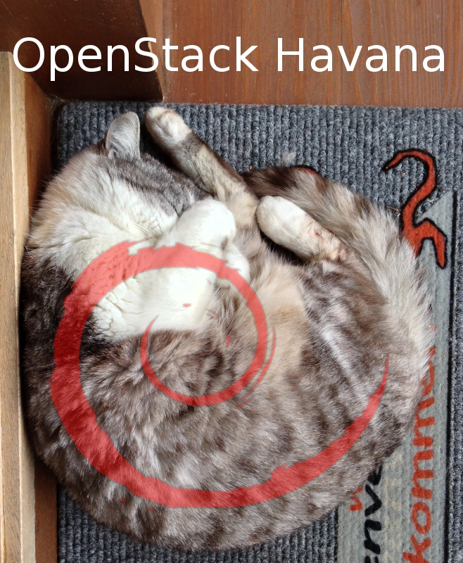

OpenStack-Install-Guide
=======================

Complete installation guides for OpenStack.

If you want to install OpenStack on Debian, this is the site for you.

==================   ======================================================
OpenStack Release    Guide URL
==================   ======================================================
Havana               `OpenStack_Havana_Debian_Wheezy_Install_Guide  <https://github.com/reusserl/OpenStack-Install-Guide/blob/master/OpenStack_Havana_Debian_Wheezy_Install_Guide.rst>`_
==================   ======================================================

If you would like to use Ubuntu instead of Debian, try this site:
`https://github.com/mseknibilel/ <https://github.com/mseknibilel/OpenStack-Grizzly-Install-Guide/>`_ 